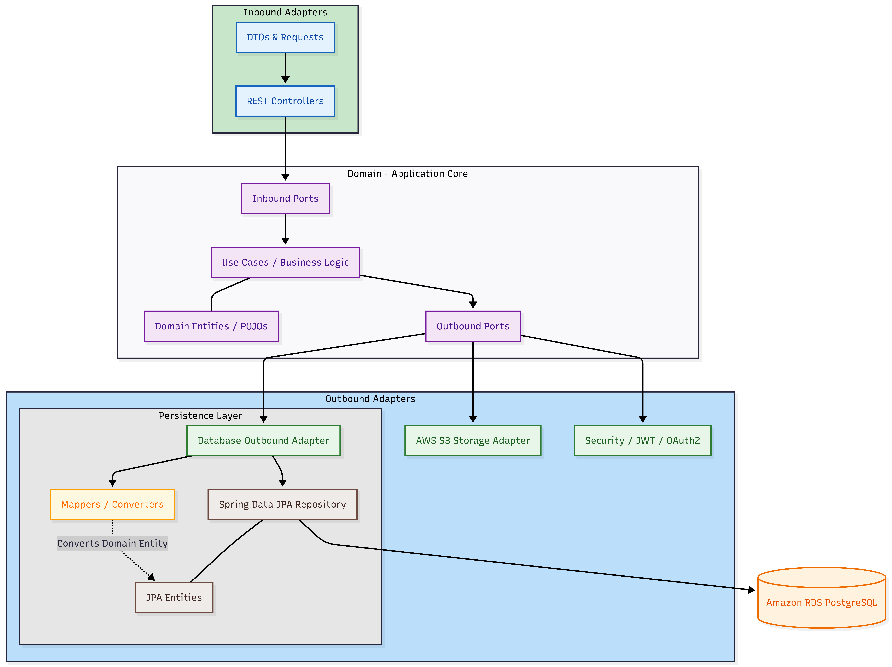

# Radioscan API

Backend API for a clinic/telemedicine application focused on radiology. It supports patient and staff registration and login (using JWT and Google OAuth2), appointment scheduling, and an asynchronous AI-driven X-ray reporting workflow (featuring direct S3 uploads via pre-signed URLs and automatic classification using Machine Learning).

The application was developed following the principles of Hexagonal Architecture (Ports & Adapters), completely isolating business logic from web frameworks, databases, and cloud services, while also applying Clean Code and SOLID principles.

<br>

## Stack

- **Java 25** + **Spring Boot 4.1.0**
- **Spring Data JPA** + **PostgreSQL** (`org.postgresql` driver)
- **Spring Security** with:
- Custom authentication via **JWT** (`io.jsonwebtoken` / jjwt)
- **OAuth2 login with Google** (`spring-boot-starter-security-oauth2-client`)
- **springdoc-openapi** (Swagger UI) for interactive API documentation
- **AWS SDK v2** (`software.amazon.awssdk`) — `s3` and `sqs` modules, used to
  generate pre-signed URLs for image uploads
- **Lombok** to reduce boilerplate (getters/setters/constructors)
- **springboot3-dotenv** to load variables from a `.env` file during
  local development
- **H2** (in-memory database, used for testing)
- **Maven Wrapper** (`mvnw`/`mvnw.cmd`) — no need to have Maven
  installed globally

<br>

## Prerequisites

- **JDK 25**
- Accessible **PostgreSQL** (local, Docker, or RDS/LocalStack) — no need
  to install Maven; the project uses the Maven Wrapper (`./mvnw`)
- Optional **S3 bucket/endpoint** (compatible with local LocalStack or real AWS)—only needed if testing image uploads.

<br>

## Settings (`.env`)

The project uses [`springboot3-dotenv`](https://github.com/paulschwarz/spring-dotenv)
to load a `.env` file from the project root during local development. Copy
`.env.example` to `.env` and fill it in:

```dotenv
# Database
DB_HOST=localhost
DB_PORT=5432
DB_NAME=clinicdb
DB_USER=root
DB_PASSWORD=root
 
# JWT
JWT_SECRET_KEY=
JWT_EXPIRATION_IN_MINUTES=5
 
# OAuth2 - Google
OAUTH2_GOOGLE_CLIENT_ID=
OAUTH2_GOOGLE_CLIENT_SECRET=
```

The AWS variables (`aws.endpoint`, `aws.region`, `aws.s3.bucket-name`) have default values directly in `application.properties`, but they can also be overridden by environment variables (`AWS_ENDPOINT`, `AWS_REGION`, `AWS_S3_BUCKET_NAME`)—in Spring Boot, operating system environment variables take precedence over values in `application.properties`.

<br>

## Running locally

```powershell
.\mvnw spring-boot:run
```

By default, the API starts on the port defined in `SERVER_PORT`/`server.port`
(if not configured, the Spring Boot default is `8080`).

With `spring.jpa.hibernate.ddl-auto=update` in `application.properties`,
Hibernate automatically creates or updates the database schema upon the first
connection—there is no need to run manual migrations.

<br>

## API Documentation (Swagger)

- Swagger UI: `http://localhost:<porta>/swagger-ui.html`
- OpenAPI JSON: `http://localhost:<porta>/v3/api-docs`

<br>

## Tests

```powershell
.\mvnw test
```

<br>

## Build and deploy (Docker + LocalStack)

This repository already includes (at the root):

- `Dockerfile`
- `dockerignore`
- `build_and_push.ps1` — Build the image and publish it to the LocalStack ECR

Simplified workflow:

```powershell
.\build_and_push.ps1 -ProjectName "radioscan" -Tag "v1"
```

> Refer to the `README.md` in the infrastructure repository (https://github.com/DouglaasPH/terraform-radioscan) for the complete
> step-by-step guide (spinning up LocalStack, applying the infrastructure, publishing the image,
> environment variables injected into the container by ECS, etc.).

<br>

## Architecture / Project Organization

The project adopts Clean Code, SOLID, and Hexagonal Architecture principles to ensure low coupling, high testability, and technology independence in the business core.

### Role of each layer:

* **Domain (Core):** Pure Java code without dependencies on frameworks (such as Spring) or infrastructure libraries.
    * `domain/domain/`: Pure domain entities (POJOs) representing the system's core state and behaviors.
    * `domain/ports/inbound/`: Interfaces defining the business operations exposed to inbound adapters.
    * `domain/ports/outbound/`: Interfaces defining the contracts required for the domain to interact with external adapters.
    * `domain/results/`: Pure return objects (internal domain DTOs) generated by use cases or external adapters. They carry data processed by business rules to the controller (inbound adapter), where they are mapped to Response DTOs for the end client.
    * `domain/usecases/`: Contains use case implementations, where business rules reside.

* **Inbound Adapters (Input):** The system's data entry point. They translate external requests into use case calls via *Inbound Ports*.
    * `adapter/inbound/controller/`: REST Controllers and Request/Response DTOs.

* **Outbound Adapters:** Implementations of the contracts defined in the *Outbound Ports*.
    * `adapter/outbound/repository/`: Persistence adaptations using Spring Data JPA. Converts database entities (`JPA Entities`) into pure entities (`Domain Entities`) and vice versa via Mappers.
    * `adapter/outbound/storage/`: Integrations with cloud file storage services (AWS S3).
    * `adapter/outbound/security/`: Implementations of authentication mechanisms, JWT generation, password encryption, and Google OAuth2 integration.

* **Configuration & General Infrastructure:**
    * `config/aws/`: AWS SDK bean configurations (such as the Amazon S3 client).
    * `config/security/`: Spring Security configurations, CORS rules, HTTP filters (JWT Filter), and authentication chains.
    * `handler/` *(or `exceptions/handler/`)*: Global API exception handling (`GlobalExceptionHandler`), intercepting application/domain exceptions and formatting them into standardized HTTP error responses.

<br>

## Architecture Diagram



<br>

## Folder Structure

```
src
├───main
│   ├───java
│   │   └───com
│   │       └───douglaasph
│   │           └───clinic_api
│   │               │   ClinicApiApplication.java
│   │               │   
│   │               ├───adapter
│   │               │   ├───inbound
│   │               │   │   └───controller
│   │               │   │       ├───admin
│   │               │   │       │   │   AdminController.java
│   │               │   │       │   │   
│   │               │   │       │   └───response
│   │               │   │       │           DashboardAdminMetricsResponse.java
│   │               │   │       │           
│   │               │   │       ├───appointment
│   │               │   │       │   │   AppointmentController.java
│   │               │   │       │   │   
│   │               │   │       │   ├───request
│   │               │   │       │   │       CreateAppointmentRequest.java
│   │               │   │       │   │       
│   │               │   │       │   └───response
│   │               │   │       │           AppointmentsLinkedToThePatientResponse.java
│   │               │   │       │           AppointmentsManagementResponse.java
│   │               │   │       │           AvailabilitiesAppointmentsResponse.java
│   │               │   │       │           EmployeesMetricsResponse.java
│   │               │   │       │           UrlPressignedS3Response.java
│   │               │   │       │           
│   │               │   │       ├───auth
│   │               │   │       │   │   AuthController.java
│   │               │   │       │   │   
│   │               │   │       │   ├───request
│   │               │   │       │   │       LoginGoogleRequest.java
│   │               │   │       │   │       LoginRequest.java
│   │               │   │       │   │       
│   │               │   │       │   └───response
│   │               │   │       │           LoginResponse.java
│   │               │   │       │           
│   │               │   │       ├───employee
│   │               │   │       │   │   EmployeeController.java
│   │               │   │       │   │   
│   │               │   │       │   ├───request
│   │               │   │       │   │       CreateEmployeeRequest.java
│   │               │   │       │   │       
│   │               │   │       │   └───response
│   │               │   │       │           MetricsEmployeesForAdminResponse.java
│   │               │   │       │           
│   │               │   │       ├───patient
│   │               │   │       │   │   PatientController.java
│   │               │   │       │   │   
│   │               │   │       │   └───request
│   │               │   │       │           CreatePatientRequest.java
│   │               │   │       │           
│   │               │   │       ├───refreshtoken
│   │               │   │       │       RefreshTokenController.java
│   │               │   │       │       
│   │               │   │       ├───user
│   │               │   │       │   │   UserController.java
│   │               │   │       │   │   
│   │               │   │       │   ├───request
│   │               │   │       │   │       UpdateUserDataRequest.java
│   │               │   │       │   │       UpdateUserPasswordRequest.java
│   │               │   │       │   │       
│   │               │   │       │   └───response
│   │               │   │       │           UserResponse.java
│   │               │   │       │           
│   │               │   │       └───xrayreport
│   │               │   │           │   XRayReportController.java
│   │               │   │           │   
│   │               │   │           ├───request
│   │               │   │           │       DoctorReviewExamRequest.java
│   │               │   │           │       
│   │               │   │           └───response
│   │               │   │                   ExamDownloadUrlResponse.java
│   │               │   │                   
│   │               │   └───outbound
│   │               │       ├───repository
│   │               │       │   ├───appointment
│   │               │       │   │       AppointmentJpaEntity.java
│   │               │       │   │       AppointmentJPaMapper.java
│   │               │       │   │       AppointmentRepository.java
│   │               │       │   │       GetAllAvailabilitiesAppointmentsAdapter.java
│   │               │       │   │       GetAppointmentByIdAdapter.java
│   │               │       │   │       GetAppointmentsLinkedToThePatientAdapter.java
│   │               │       │   │       GetAppointmentsManagementWithPaginationAdapter.java
│   │               │       │   │       GetMetricsForEmployeeDashboardAdapter.java
│   │               │       │   │       SaveAppointmentAdapter.java
│   │               │       │   │       
│   │               │       │   ├───employee
│   │               │       │   │       EmployeeJpaEntity.java
│   │               │       │   │       EmployeeJpaMapper.java
│   │               │       │   │       EmployeeRepository.java
│   │               │       │   │       GetEmployeeByIdAdapter.java
│   │               │       │   │       GetEmployeesForManagementWithPaginationAdapter.java
│   │               │       │   │       GetMetricsEmployeesForAdminAdapter.java
│   │               │       │   │       SaveEmployeeAdapter.java
│   │               │       │   │       
│   │               │       │   ├───metrics
│   │               │       │   │       GetDashboardMetricsForAdminAdapter.java
│   │               │       │   │       
│   │               │       │   ├───patient
│   │               │       │   │       GetPatientByIdAdapter.java
│   │               │       │   │       PatientJpaEntity.java
│   │               │       │   │       PatientJpaMapper.java
│   │               │       │   │       PatientRepository.java
│   │               │       │   │       SavePatientAdapter.java
│   │               │       │   │       
│   │               │       │   ├───refreshtoken
│   │               │       │   │       CreateRefreshTokenAdapter.java
│   │               │       │   │       DeleteRefreshTokenAdapter.java
│   │               │       │   │       DeleteRefreshTokensByUserIdAdapter.java
│   │               │       │   │       GetRefreshTokenAdapter.java
│   │               │       │   │       RefreshTokenJpaEntity.java
│   │               │       │   │       RefreshTokenJpaMapper.java
│   │               │       │   │       RefreshTokenRepository.java
│   │               │       │   │       
│   │               │       │   ├───user
│   │               │       │   │       GetUserByEmailAdapter.java
│   │               │       │   │       SaveUserAdapter.java
│   │               │       │   │       UserJpaEntity.java
│   │               │       │   │       UserJpaMapper.java
│   │               │       │   │       UserRepository.java
│   │               │       │   │       
│   │               │       │   └───xrayreport
│   │               │       │           GetXRayReportByIdAdapter.java
│   │               │       │           SaveXRayReportAdapter.java
│   │               │       │           XRayReportJpaEntity.java
│   │               │       │           XRayReportJpaMapper.java
│   │               │       │           XRayReportRepository.java
│   │               │       │           
│   │               │       ├───security
│   │               │       │       CredentialsAuthenticatorAdapter.java
│   │               │       │       GoogleTokenVerifierAdapter.java
│   │               │       │       JwtTokenAdapter.java
│   │               │       │       PasswordEncoderAdapter.java
│   │               │       │       UserDetailsServiceAdapter.java
│   │               │       │       
│   │               │       └───storage
│   │               │               S3StorageAdapter.java
│   │               │               
│   │               ├───config
│   │               │   ├───aws
│   │               │   │       S3Config.java
│   │               │   │       
│   │               │   └───security
│   │               │           CorsConfig.java
│   │               │           JwtFilter.java
│   │               │           SecurityConfig.java
│   │               │           SecurityUtils.java
│   │               │           UserPrincipal.java
│   │               │           
│   │               ├───domain
│   │               │   ├───domain
│   │               │   │   │   Appointment.java
│   │               │   │   │   Employee.java
│   │               │   │   │   Patient.java
│   │               │   │   │   RefreshToken.java
│   │               │   │   │   User.java
│   │               │   │   │   XRayReport.java
│   │               │   │   │   
│   │               │   │   └───enums
│   │               │   │           AppointmentStatus.java
│   │               │   │           AppointmentType.java
│   │               │   │           Position.java
│   │               │   │           ProcessingStatus.java
│   │               │   │           Roles.java
│   │               │   │           
│   │               │   ├───ports
│   │               │   │   ├───inbound
│   │               │   │   │       AppointmentMetricsForEmployeesUseCasePort.java
│   │               │   │   │       AuthenticateGoogleUserUseCasePort.java
│   │               │   │   │       AuthenticateUserUseCasePort.java
│   │               │   │   │       BookExamCaptureUseCasePort.java
│   │               │   │   │       BookReportReviewUseCasePort.java
│   │               │   │   │       CancelAppointmentUseCasePort.java
│   │               │   │   │       CreateAppointmentUseCasePort.java
│   │               │   │   │       CreateEmployeeAccountUseCasePort.java
│   │               │   │   │       CreatePatientAccountUseCasePort.java
│   │               │   │   │       DoctorReviewExamUseCasePort.java
│   │               │   │   │       GetAllAvailabilitiesAppointmentsUseCasePort.java
│   │               │   │   │       GetAppointmentByIdUseCasePort.java
│   │               │   │   │       GetAppointmentLinkedToThePatientUseCasePort.java
│   │               │   │   │       GetAppointmentsManagementWithPaginationUseCasePort.java
│   │               │   │   │       GetDashboardMetricsForAdminUseCasePort.java
│   │               │   │   │       GetEmployeesForManagementWithPaginationUseCasePort.java
│   │               │   │   │       GetExamDownloadUrlUseCasePort.java
│   │               │   │   │       GetMetricsEmployeesForAdminUseCasePort.java
│   │               │   │   │       GetMyUserDataByEmailUseCasePort.java
│   │               │   │   │       RefreshTokenUseCasePort.java
│   │               │   │   │       StartExamCaptureUseCasePort.java
│   │               │   │   │       UpdateUserDataUseCasePort.java
│   │               │   │   │       UpdateUserPasswordUseCasePort.java
│   │               │   │   │       
│   │               │   │   └───outbound
│   │               │   │           CreateRefreshTokenAdapterPort.java
│   │               │   │           CreateSessionUseCasePort.java
│   │               │   │           CredentialsAuthenticatorAdapterPort.java
│   │               │   │           DeleteRefreshTokenAdapterPort.java
│   │               │   │           DeleteRefreshTokensByUserIdAdapterPort.java
│   │               │   │           FileStorageAdapterPort.java
│   │               │   │           GetAllAvailabilitiesAppointmentsAdapterPort.java
│   │               │   │           GetAppointmentByIdAdapterPort.java
│   │               │   │           GetAppointmentsLinkedToThePatientAdapterPort.java
│   │               │   │           GetAppointmentsManagementWithPaginationAdapterPort.java
│   │               │   │           GetDashboardMetricsForAdminAdapterPort.java
│   │               │   │           GetEmployeeByIdAdapterPort.java
│   │               │   │           GetEmployeesForManagementWithPaginationAdapterPort.java
│   │               │   │           GetMetricsEmployeesForAdminAdapterPort.java
│   │               │   │           GetMetricsForEmployeeDashboardAdapterPort.java
│   │               │   │           GetPatientByIdAdapterPort.java
│   │               │   │           GetRefreshTokenByTokenAdapterPort.java
│   │               │   │           GetUserByEmailAdapterPort.java
│   │               │   │           GetXRayReportByIdAdapterPort.java
│   │               │   │           GoogleTokenVerifierAdapterPort.java
│   │               │   │           PasswordEncoderAdapterPort.java
│   │               │   │           SaveAppointmentAdapterPort.java
│   │               │   │           SaveEmployeeAdapterPort.java
│   │               │   │           SavePatientAdapterPort.java
│   │               │   │           SaveUserAdapterPort.java
│   │               │   │           SaveXRayReportAdapterPort.java
│   │               │   │           TokenProviderAdapterPort.java
│   │               │   │           
│   │               │   ├───results
│   │               │   │       AppointmentsLinkedToThePatientResult.java
│   │               │   │       AppointmentsManagementResult.java
│   │               │   │       AvailabilitiesAppointmentsResult.java
│   │               │   │       DashboardAdminMetricsResult.java
│   │               │   │       EmployeesMetricsResult.java
│   │               │   │       LoginResult.java
│   │               │   │       MetricsEmployeesForAdminResult.java
│   │               │   │       UrlPressignedS3Result.java
│   │               │   │       
│   │               │   └───usecases
│   │               │           AppointmentMetricsForEmployeesUseCase.java
│   │               │           AuthenticateGoogleUserUseCase.java
│   │               │           AuthenticateUserUseCase.java
│   │               │           BookExamCaptureUseCase.java
│   │               │           BookReportReviewUseCase.java
│   │               │           CancelAppointmentUseCase.java
│   │               │           CreateAppointmentUseCase.java
│   │               │           CreateEmployeeAccountUseCase.java
│   │               │           CreatePatientAccountUseCase.java
│   │               │           CreateSessionUseCase.java
│   │               │           DoctorReviewExamUseCase.java
│   │               │           GetAllAvailabilitiesAppointmentsUseCase.java
│   │               │           GetAppointmentByIdUseCase.java
│   │               │           GetAppointmentLinkedToThePatientUseCase.java
│   │               │           GetAppointmentsManagementWithPaginationUseCase.java
│   │               │           GetDashboardMetricsForAdminUseCase.java
│   │               │           GetEmployeesForManagementWithPaginationUseCase.java
│   │               │           GetExamDownloadUrlUseCase.java
│   │               │           GetMetricsEmployeesForAdminUseCase.java
│   │               │           GetMyUserDataByEmailUseCase.java
│   │               │           RefreshTokenUseCase.java
│   │               │           StartExamCaptureUseCase.java
│   │               │           UpdateUserDataUseCase.java
│   │               │           UpdateUserPasswordUseCase.java
│   │               │           
│   │               └───exceptions
│   │                   │   AccessDeniedException.java
│   │                   │   AppointmentConflictException.java
│   │                   │   BusinessRuleException.java
│   │                   │   DatabaseException.java
│   │                   │   InvalidPasswordException.java
│   │                   │   ReportNotReleasedException.java
│   │                   │   ResourceNotFoundException.java
│   │                   │   TokenException.java
│   │                   │   
│   │                   └───handler
│   │                           GlobalExceptionHandler.java
│   │                           StandardError.java
│   │                           
│   └───resources
│           application.properties
│           
└───test
├───java
│   └───com
│       └───douglaasph
│           └───clinic_api
│               │   ClinicApiApplicationTests.java
│               │   
│               ├───adapters
│               │   └───outbound
│               │       └───repository
│               │           ├───appointment
│               │           │       GetAllAvailabilitiesAppointmentsAdapterTest.java
│               │           │       GetAppointmentByIdAdapterTest.java
│               │           │       GetAppointmentsLinkedToThePatientAdapterTest.java
│               │           │       GetAppointmentsManagementWithPaginationAdapterTest.java
│               │           │       GetMetricsForEmployeeDashboardAdapterTest.java
│               │           │       SaveAppointmentAdapterTest.java
│               │           │       
│               │           ├───employee
│               │           │       GetEmployeeByIdAdapterTest.java
│               │           │       GetEmployeesForManagementWithPaginationAdapterTest.java
│               │           │       GetMetricsEmployeesForAdminAdapterTest.java
│               │           │       SaveEmployeeAdapterTest.java
│               │           │       
│               │           ├───metrics
│               │           │       GetDashboardMetricsForAdminAdapterTest.java
│               │           │       
│               │           ├───patient
│               │           │       GetPatientByIdAdapterTest.java
│               │           │       SavePatientAdapterTest.java
│               │           │       
│               │           ├───refreshtoken
│               │           │       CreateRefreshTokenAdapterTest.java
│               │           │       DeleteRefreshTokenAdapterTest.java
│               │           │       DeleteRefreshTokensByUserIdAdapterTest.java
│               │           │       GetRefreshTokenAdapterTest.java
│               │           │       
│               │           ├───security
│               │           │       CredentialsAuthenticatorAdapterTest.java
│               │           │       JwtTokenAdapterTest.java
│               │           │       UserDetailsServiceAdapterTest.java
│               │           │       
│               │           ├───user
│               │           │       GetUserByEmailAdapterTest.java
│               │           │       SaveUserAdapterTest.java
│               │           │       
│               │           └───xrayreport
│               │                   GetXRayReportByIdAdapterTest.java
│               │                   SaveXRayReportAdapterTest.java
│               │                   
│               └───usecases
│                       AppointmentMetricsForEmployeesUseCaseTest.java
│                       AuthenticateGoogleUserUseCaseTest.java
│                       AuthenticateUserUseCaseTest.java
│                       BookExamCaptureUseCaseTest.java
│                       BookReportReviewUseCaseTest.java
│                       CancelAppointmentUseCaseTest.java
│                       CreateAppointmentUseCaseTest.java
│                       CreateEmployeeAccountUseCaseTest.java
│                       CreatePatientAccountUseCaseTest.java
│                       CreateSessionUseCaseTest.java
│                       DoctorReviewExamUseCaseTest.java
│                       GetAllAvailabilitiesAppointmentsUseCaseTest.java
│                       GetAppointmentByIdUseCaseTest.java
│                       GetAppointmentLinkedToThePatientUseCaseTest.java
│                       GetAppointmentsManagementWithPaginationUseCaseTest.java
│                       GetDashboardMetricsForAdminUseCaseTest.java
│                       GetEmployeesForManagementWithPaginationUseCaseTest.java
│                       GetExamDownloadUrlUseCaseTest.java
│                       GetMetricsEmployeesForAdminUseCaseTest.java
│                       GetMyUserDataByEmailUseCaseTest.java
│                       RefreshTokenUseCaseTest.java
│                       StartExamCaptureUseCaseTest.java
│                       UpdateUserDataUseCaseTest.java
│                       UpdateUserPasswordUseCaseTest.java
│                       
└───resources
application-test.properties
```